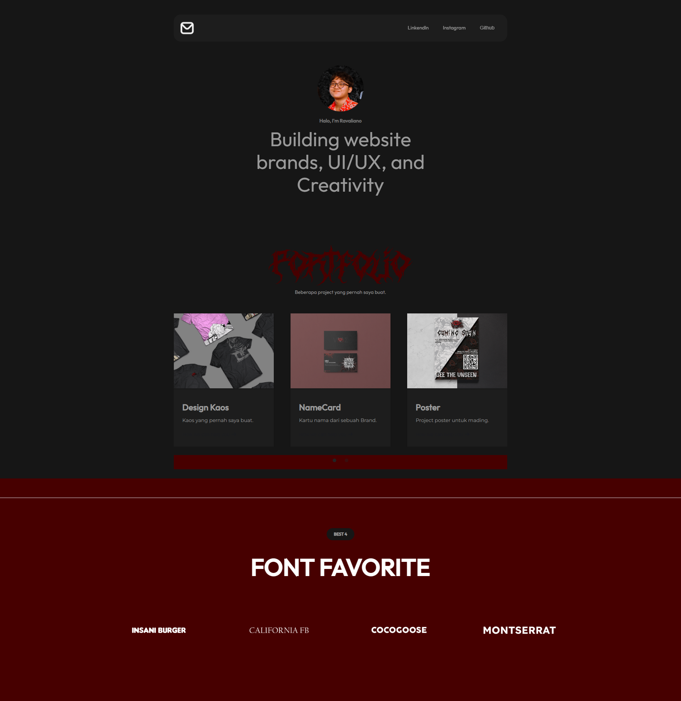

# Adrian Ravaliano Wibowo's portfolio website

## Deskripsi website

Website Portofolio ini berisikan kontak person dan project yang telah dikerjakan oleh Adrian Ravaliano Wibowo, seperti:
- Linkendin
- Instagram
- Github
- Mockup
- Design

Website ini dibuat dalam rangka mengerjakan tugas ketiga individu mata kuliah Pemrograman Visual.

## Tampilan website

Tampilan tersebut dapat dilihat di [link berikut (https://webflow.com/design/ravaliano-portfolio/)](https://webflow.com/design/ravaliano-portfolio/)

## Optimalisasi website

Nilai lighthouse sebelum optimalisasi
(screenshot)

Nilai lighthouse setelah optimalisasi
(screenshot)

Langkah-langkah yang dilakukan untuk meningkatkan nilai kualitas website dari lighthouse:
1.
1.
1.
